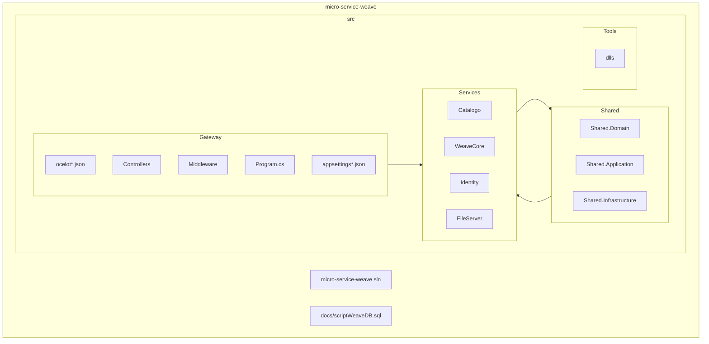

# Diagrama de Arquitectura y Estructura – micro-service-weave

A continuación se presenta un diagrama Mermaid que describe la arquitectura y la estructura del proyecto, incluyendo Gateway/Ocelot, APIs, librerías compartidas, auditoría, repositorio genérico y flujo de borrado lógico en entidades core.

```mermaid
flowchart TB
  %% Estilos (opcionales)
  classDef gateway fill:#fff3cd,stroke:#b68,stroke-width:1px,color:#333
  classDef shared fill:#f6f6f6,stroke:#999,stroke-width:1px,color:#333
  classDef service fill:#e8f4ff,stroke:#339,stroke-width:1px,color:#333
  classDef core fill:#ffe7e7,stroke:#d33,stroke-width:1px,color:#333
  classDef catalogo fill:#e7fff7,stroke:#3a6,stroke-width:1px,color:#333
  classDef infra fill:#eee,stroke:#666,stroke-width:1px,color:#333
  classDef storage fill:#e6ffe6,stroke:#6b6,stroke-width:1px,color:#333

  %% Cliente / Usuarios
  U[Cliente / Frontend / Consumidores]:::infra

  %% Gateway
  subgraph G[Gateway.Api]
    direction TB
    GMW[Middleware\nPropaga cabeceras\nX-User-Id, X-Personal-Id, X-Role-Id,\nX-Username, X-Email, X-Auth-Mode]:::gateway
    GOcelot[Ocelot\nocelot.json\nocelot.Development.json\nocelot.Production.json]:::gateway
    GControllers[Controllers y Endpoints]:::gateway
    GConfig[appsettings*.json]:::gateway
    GControllers --> GMW --> GOcelot
  end

  U -->|HTTP| G

  %% Librerías compartidas
  subgraph Shared[Shared]
    direction TB
    subgraph SD[Shared.Domain]
      BaseEntity[(BaseEntity)]:::shared
    end
    subgraph SA[Shared.Application]
      IContracts[IUserContextService\nIAuditService]:::shared
      AudHandlers[Handlers Auditables\nAuditableCreateEntityHandler<T>\nAuditableUpdateEntityHandler<T>\nAuditableCreateEntitiesHandler<T>]:::shared
      GenHandlers[Handlers Genéricos\nCreateEntityHandler<T>\nUpdateEntityHandler<T>\nDeleteEntityHandler<T>]:::shared
      SPExec[IStoredProcedureExecutor]:::shared
    end
    subgraph SI[Shared.Infrastructure]
      Repo[Repositorio Genérico (Dapper)\nSQL dinámico por propiedades del modelo]:::shared
      SPExecImpl[StoredProcedureExecutor Impl]:::shared
    end
    BaseEntity --> AudHandlers
    IContracts --> AudHandlers
    IContracts --> GenHandlers
    Repo --> AudHandlers
    Repo --> GenHandlers
    SPExec --> AudHandlers
    SPExecImpl --> SPExec
  end

  %% Servicios / APIs
  subgraph S[Services]
    direction TB

    %% Catalogo (catálogo: no auditable, delete físico)
    subgraph Catalogo[Catalogo.Api]
      direction TB
      CControllers[Controllers\nCRUD Catálogo]:::catalogo
      CServices[Services\nUserContextService\nAuditService]:::catalogo
      CDomain[Entities Catálogo\n(no heredan BaseEntity)]:::catalogo
      CApp[Application\nComandos/Queries\nHandlers Genéricos]:::catalogo
      CDB[(DB Catálogo)]:::infra
      CControllers --> CApp --> CServices
      CApp --> CDB
    end

    %% WeaveCore (core: auditable, delete lógico)
    subgraph WeaveCore[WeaveCore.Api]
      direction TB
      WControllers[Controllers\nCore auditable]:::core
      WServices[Services\nUserContextService\nAuditService]:::core
      WDomain[Entities Core\n(heredan BaseEntity)]:::core
      WApp[Application\nComandos/Queries\nHandlers Auditables]:::core
      WDB[(DB WeaveCore)]:::infra
      WControllers --> WApp --> WServices
      WApp --> WDB
    end

    %% Identity (autenticación/usuarios)
    subgraph Identity[Identity.Api]
      direction TB
      IControllers[Controllers]:::service
      IServices[Services / Dominio]:::service
      IDB[(DB Identity)]:::infra
      IControllers --> IServices --> IDB
    end

    %% FileServer (archivos / storage)
    subgraph FileServer[FileServer.Api]
      direction TB
      FControllers[Controllers]:::service
      FServices[Servicios / Storage]:::service
      FStorage[(File System / Blob Storage)]:::storage
      FControllers --> FServices --> FStorage
    end
  end

  %% Rutas desde Gateway hacia APIs
  GControllers -- "/api/<ApiName>/{everything}" --> CControllers
  GControllers -- "/api/<ApiName>/{everything}" --> WControllers
  GControllers -- "/api/<ApiName>/{everything}" --> IControllers
  GControllers -- "/api/<ApiName>/{everything}" --> FControllers

  %% Dependencias: APIs usan Shared
  CControllers -.-> SA
  WControllers -.-> SA
  IControllers -.-> SA
  FControllers -.-> SA

  %% Flujo de borrado lógico (Core)
  subgraph DeleteLogico[Flujo DELETE lógico en Core]
    direction LR
    D1[Controller\nHttpDelete -> GetEntityById]:::core
    D2[Marcar RegistroEliminado = true]:::core
    D3[UpdateEntityCommand<CoreEntity>]:::core
    D4[AuditableUpdateEntityHandler<T>]:::shared
    D5[_auditService.ProcessDeleteAudit(...)]:::shared
    D6[Repositorio Genérico -> SQL UPDATE]:::shared
    D7[(DB Core)]:::infra
    D1 --> D2 --> D3 --> D4 --> D5 --> D6 --> D7
  end
  WControllers --> D1

  %% Notas de Auditoría y Cabeceras
  NoteAud["Auditoría: cabeceras propagadas por Gateway (X-User-Id, X-Username, etc.)\nCampos: CreadoPor, FechaCreacion, ActualizadoPor, FechaActualizacion,\nRegistroEliminado, Estado, (Version opcional)"]:::shared
  GMW --> NoteAud

  %% Política de verificación por build
  Build[Verificación por build:\n'dotnet restore' + 'dotnet build -c Debug'\nSin 'dotnet run' en esta fase]:::infra
  U -.-> Build
```

## Estructura de carpetas (vista general)



---

Notas clave:
- Gateway enruta mediante Ocelot con el patrón upstream `"/api/<ApiName>/{everything}"` hacia `"/api/{everything}"` en cada API.
- Entidades core heredan de `BaseEntity` y aplican auditoría y borrado lógico; entidades de catálogo no heredan y usan borrado físico.
- Handlers auditables/genéricos están en `Shared.Application`; el repositorio genérico y ejecutor de SP en `Shared.Infrastructure`.
- La verificación se realiza con `dotnet restore` y `dotnet build -c Debug` (sin `dotnet run`).
 
## Flujo Dapper Executor (SP)

```mermaid
sequenceDiagram
    participant Client as Cliente
    participant Gateway as Gateway.Api
    participant Controller as Controller (API)
    participant Mediator as Mediator
    participant Handler as Handler (Application)
    participant Service as Service (Negocio)
    participant SPExec as IStoredProcedureExecutor (Shared)
    participant DapperImpl as StoredProcedureExecutor (Dapper Impl)
    participant DB as Base de Datos

    Client->>Gateway: HTTP request /api/<ApiName>/...
    Gateway->>Controller: Forward request
    Controller->>Mediator: Send Command/Query
    Mediator->>Handler: Dispatch

    alt Core auditable (Create/Update/Delete lógico)
        Handler->>Service: Validaciones y auditoría
        Service->>SPExec: ExecuteAsync("sp_nombre", params)
        Note over Service,SPExec: Las reglas de negocio viven en Service
        SPExec->>DapperImpl: Llama Dapper (Execute/Query)
        DapperImpl->>DB: EXEC sp_nombre @params
        DB-->>DapperImpl: Resultset / filas afectadas
        DapperImpl-->>SPExec: Resultado
        SPExec-->>Service: Resultado
        Service-->>Handler: DTO / rows
    else Catálogo / operación simple
        Handler->>SPExec: ExecuteAsync("sp_simple", params)
        SPExec->>DapperImpl: Llama Dapper
        DapperImpl->>DB: EXEC sp_simple
        DB-->>DapperImpl: Resultset
        DapperImpl-->>SPExec: Resultado
        SPExec-->>Handler: DTO / rows
    end

    Handler-->>Mediator: Resultado
    Mediator-->>Controller: Respuesta
    Controller-->>Gateway: HTTP 200/201/204
    Gateway-->>Client: Response

    Note over SPExec,DapperImpl: Contrato estable del SP\nCommandType.StoredProcedure\nSET NOCOUNT ON; errores vía THROW/RAISERROR
    Note over Controller: Cabeceras X-User-Id, X-Username, etc. leídas por UserContextService
```